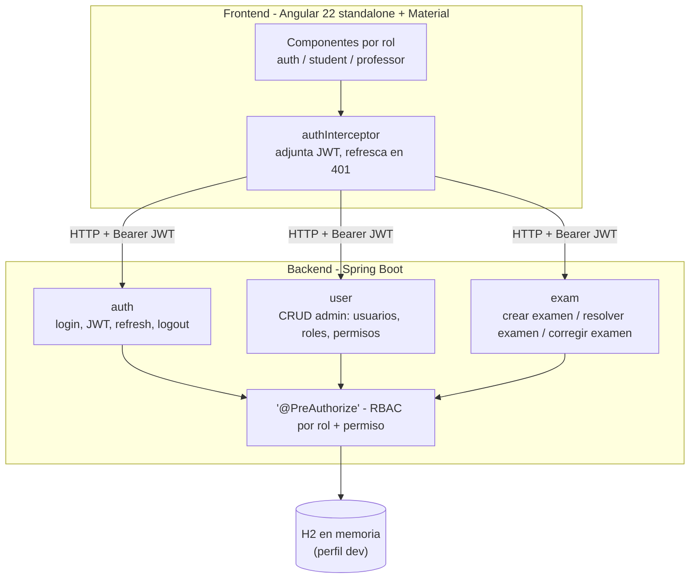
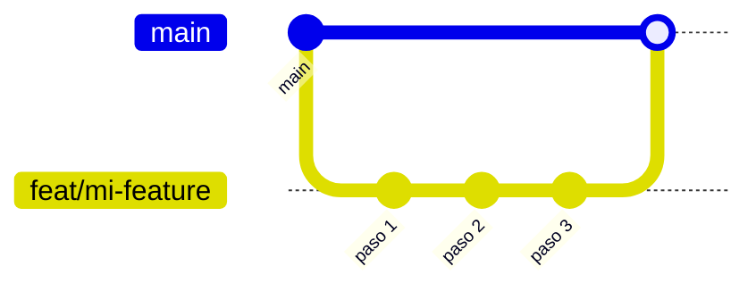

# Sistema de Examenes Online - MVP

Indice central del repositorio. Detalle tecnico vive en `backend/docs/` y `frontend/docs/`.

## Overview

Plataforma para crear y rendir examenes online.
Profesor crea examen y convocatoria. Estudiante responde en ventana habilitada. Profesor revisa y publica resultado.

## Stack

- Backend: Java 21 + Spring Boot 4 + Maven + H2
- Frontend: Angular 22 + pnpm
- Orquestacion local: Docker Compose

## Quick Start

Levantar app completa con Docker:

```bash
docker compose up --build
```

Servicios:

- Frontend: `http://localhost:4200`
- Backend API: `http://localhost:8080/api`

Detener entorno:

```bash
docker compose down
```

## Repo Map

- `backend/`: API Spring Boot
- `backend/docs/`: documentacion backend (modelo/ER, API, auth/RBAC, diagramas de secuencia)
- `frontend/`: app Angular
- `frontend/docs/`: documentacion frontend (setup, auth, testing)

## Arquitectura



Detalle de los 3 flujos del dominio de examenes (sequence diagrams + ERD): `backend/docs/exam-flows-diagrams.md`. Auth y users: `backend/docs/auth-users-diagrams.md`.

## Contribution Flow

Una rama por feature completa (varios commits chicos adentro), un PR por feature contra `main` - no un PR por cada cambio tecnico suelto.



1. Crear rama (`feat/...`, `fix/...`, `refactor/...`, `docs/...`, `chore/...`)
2. Commits chicos con formato `action(scope): summary`
3. Abrir PR contra `main` cuando la feature esta completa y sus tests pasan
4. Merge luego de revision

Tipos comunes de commit: `feat`, `fix`, `refactor`, `docs`, `test`, `chore`.

## Links

- Backend docs: `backend/docs/README.md`
- Backend auth JWT spec: `backend/docs/specs/backend-auth-jwt.spec.md`
- Backend create exam spec: `backend/docs/specs/create-exam-use-case.spec.md`
- Frontend docs: `frontend/docs/README.md`
- Frontend auth JWT spec: `frontend/docs/specs/front-auth-jwt.spec.md`
