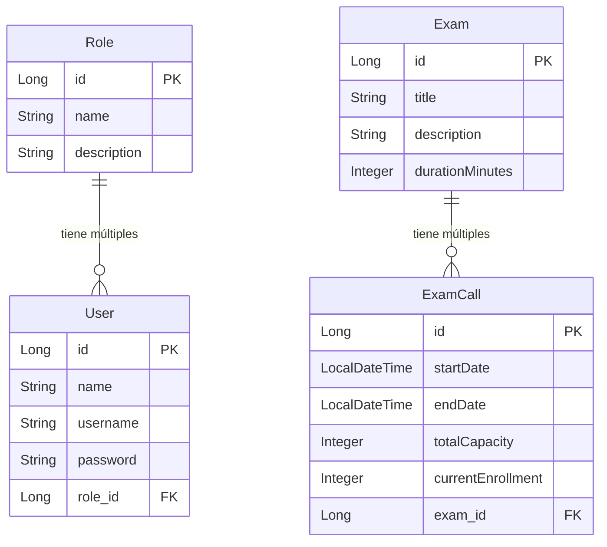

# Sistema de Exámenes - Taller IV (IPS 2026)
Plataforma orientada a la gestión integral de evaluaciones académicas. El sistema permite la administración de usuarios mediante un control de acceso basado en roles, la creación y planificación de exámenes (convocatorias), y el registro de calificaciones.
## Integrantes

- Redruello
- Mazziotta
- Duarte
- Orzusa

## Requerimientos del Proyecto
- **Arquitectura:** Backend y Frontend separados.
- **Seguridad:** Implementación de JWT (JSON Web Tokens).
- **Roles:** Mínimo 2 roles (actualmente modelados: Admin, Teacher, Student).
- **Persistencia:** Uso de ORM (Hibernate / Spring Data JPA).
- **Alcance:** Proyecto conciso y enfocado, con entre 5 a 7 entidades principales en la base de datos.

## Tecnologías

- Java 21, Spring Boot 4.0.6, Maven, H2 Database

## Ejecución Local

```bash
mvn clean install
mvn spring-boot:run
```

## Diagrama Entidad-Relación (Estado Actual)


