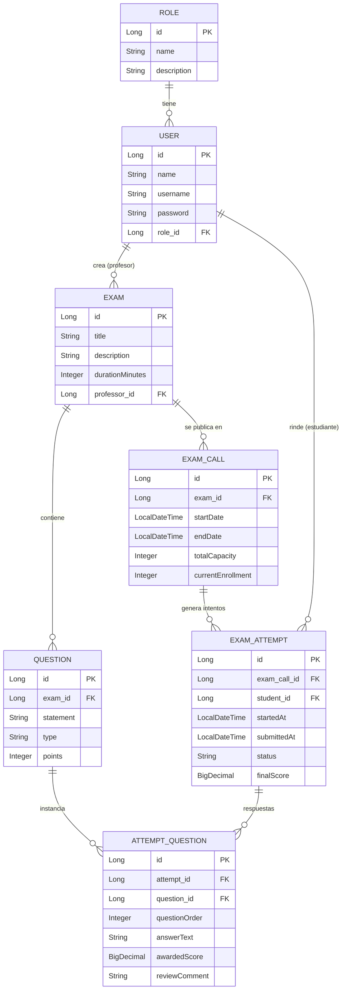
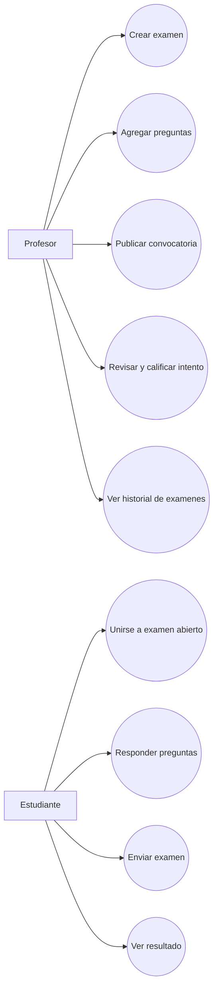

# Sistema de Examenes Online - MVP

Plataforma para crear y rendir examenes online.
El profesor crea examenes con preguntas, el estudiante responde durante una ventana habilitada y luego espera la revision del profesor para ver su resultado.

## Integrantes

- Redruello
- Mazziotta
- Duarte
- Orzusa

## Objetivo del MVP

Optimizar:

- la generacion de examenes,
- el proceso de correccion,
- la experiencia de evaluacion del estudiante.

## Alcance funcional (MVP)

- Autenticacion JWT con roles y permisos (RBAC): `ADMIN`, `PROFESSOR`, `STUDENT`.
- El administrador gestiona permisos por rol y crea usuarios profesor.
- Solo el estudiante puede registrarse por API publica.
- El profesor crea examenes y preguntas.
- El profesor habilita una convocatoria (fecha/hora de inicio y fin).
- El estudiante solo puede rendir si la convocatoria esta abierta.
- Al iniciar, el sistema genera un intento unico por estudiante con preguntas en orden aleatorio.
- El estudiante envia respuestas y su intento queda cerrado (no editable).
- El profesor revisa y califica intentos (sin modificar respuestas del estudiante).
- El estudiante consulta su resultado al finalizar la revision.

## Arquitectura

- Frontend: Angular
- Backend: Java + Spring Boot
- Base de datos: Relacional (JPA/Hibernate)

## Estructura del repositorio

- `backend/`: API Spring Boot (Maven, servicio `exam-system`).
- `frontend/`: aplicacion Angular 22 (pnpm, proyecto `exam-system`).

## Tecnologias

- Java 21
- Spring Boot 4.0.6
- Maven
- H2 Database
- Angular 22
- pnpm

## Ejecucion local

Levanta backend y frontend en contenedores para pruebas locales.

```bash
docker compose up --build
```

Servicios disponibles:

- Frontend: `http://localhost:4200`
- Backend API: `http://localhost:8080/api`
  - Auth: `POST /api/auth/register`, `POST /api/auth/login`, `POST /api/auth/refresh`, `POST /api/auth/logout`, `POST /api/auth/logout-all`
  - Usuarios/Roles: `GET /api/users/me`, `PATCH /api/users/me`, `POST /api/users/professors`, `GET/PATCH /api/roles/{role}/permissions`
  - Examenes: `GET /api/exams`, `POST /api/exams`, `POST /api/exam-workflow/calls/{examCallId}/solve`, `PATCH /api/exam-workflow/attempts/{attemptId}/grade`, `GET /api/exam-workflow/my-validations`, `GET /api/exam-workflow/my-results`

Nota:

- Salvo endpoints publicos de auth (`register`, `login`, `refresh`), el resto de `/api/**` requiere token Bearer JWT.

## Configuracion de seguridad y DB

- El backend usa migraciones con Flyway (`backend/src/main/resources/db/migration`).
- Variables recomendadas para produccion:
  - `APP_JWT_SECRET`
  - `APP_JWT_ISSUER`
  - `APP_JWT_ACCESS_TTL`
  - `APP_JWT_REFRESH_TTL`
- En desarrollo se puede usar seed de admin con:
  - `app.bootstrap.seed-admin=true`
  - `app.bootstrap.admin-username`
  - `app.bootstrap.admin-password`

Para detener y eliminar contenedores:

```bash
docker compose down
```

## Flujo de contribucion (Git)

Modelo recomendado: ramas por funcionalidad + Pull Request a `main`.

1. Crear rama:
   - `feature/...`
   - `fix/...`
   - `docs/...`
2. Commits con formato:
   - `action(scope): summary`
3. Abrir PR y solicitar revision.
4. Merge a `main` luego de aprobacion.

### Convencion de commits

Formato:

`action(scope): summary`

Acciones sugeridas:

- `feat`: nueva funcionalidad
- `fix`: correccion de bug
- `refactor`: mejora interna sin cambio funcional
- `docs`: documentacion
- `test`: pruebas
- `chore`: tareas tecnicas

Ejemplos:

- `feat(exam): agregar creacion de preguntas`
- `fix(auth): validar rol de estudiante en inicio de intento`
- `docs(readme): actualizar alcance mvp`

## Como crear un Pull Request

1. Actualizar tu rama con `main`.
2. Verificar que compile y pasen los tests.
3. Hacer push de la rama al remoto.
4. Crear PR con:
   - Titulo corto y descriptivo.
   - Descripcion del problema, solucion y evidencia (capturas/logs si aplica).
5. Asignar revisores.
6. Resolver comentarios y actualizar el PR.

## Diagrama Entidad-Relacion (MVP)



## Diagrama de Casos de Uso (MVP)



## Uso de IA (OpenAI / Claude / DeepSeek)

La IA no es obligatoria para el MVP, pero puede aportar valor en:

1. Asistencia al profesor para crear preguntas.
   - Generar borradores por tema y dificultad.
2. Pre-correccion de respuestas abiertas.
   - Sugerir puntaje y feedback (el profesor confirma la nota final).
3. Feedback automatico al estudiante.
   - Explicacion breve de fortalezas y puntos de mejora.

### Recomendacion practica

- Empezar con IA en modo asistente (sugerencias), no en modo automatico.
- Guardar trazabilidad: prompt, respuesta del modelo y decision final del profesor.
- Implementar un servicio desacoplado en backend (`ai-provider`) para poder cambiar entre OpenAI, Claude o DeepSeek.
