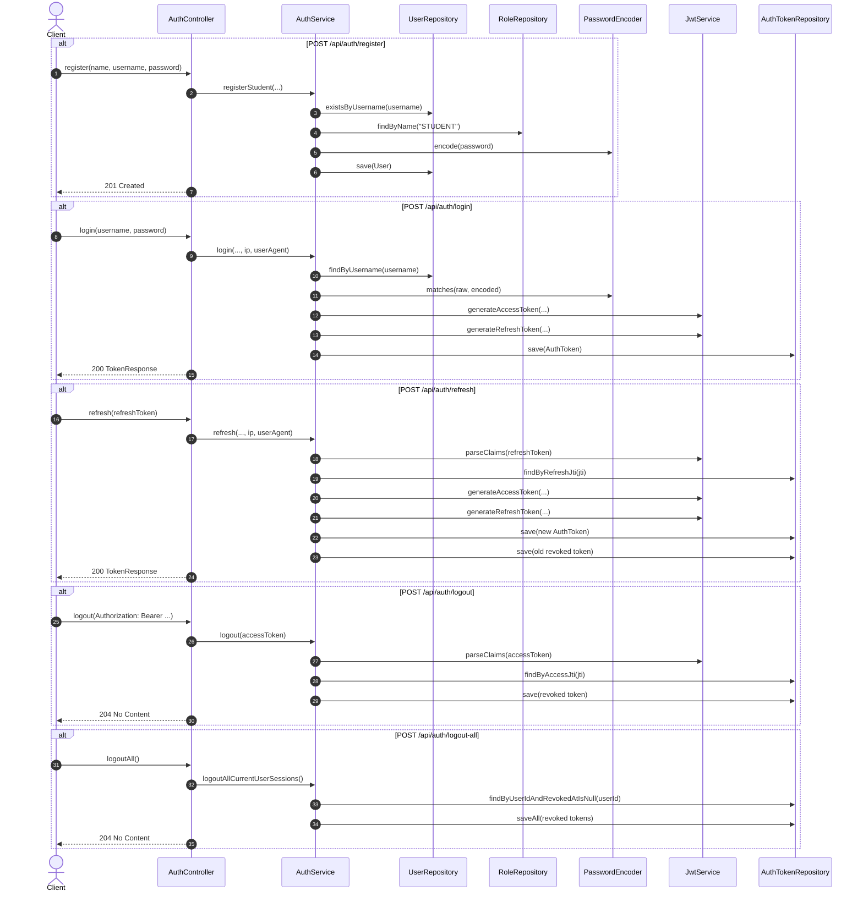
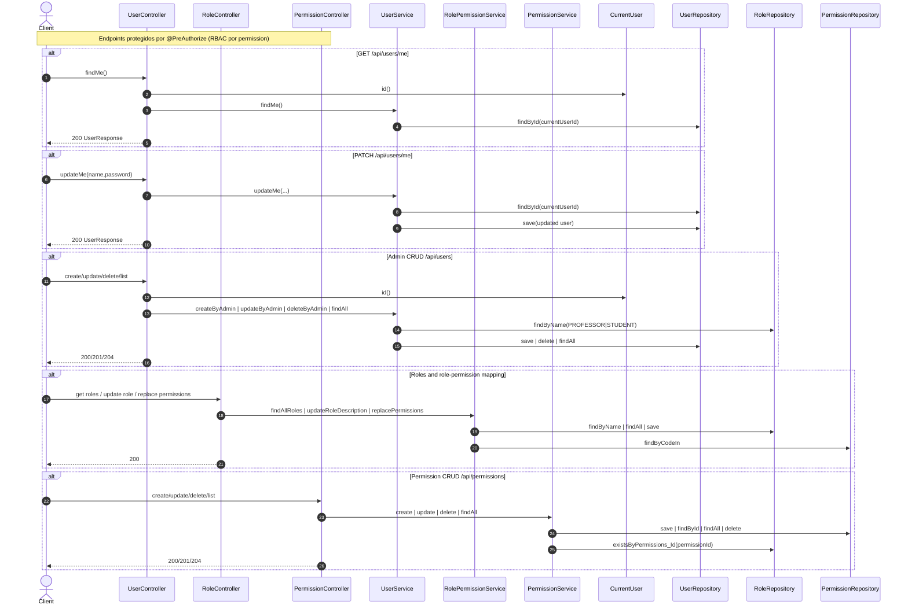
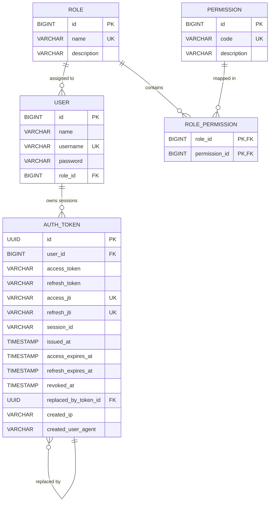

# Diagramas de modulos Auth y Users

Este documento resume flujo de llamadas y modelo de datos para los modulos `auth` y `user`.

## Sequence diagram - Auth module

## Sequence diagram - Users module

## ERD - Auth + Users schema

## Notas

- Diagramas usan nombres de entidades/campos en English para respetar codigo y schema.
- Este ERD cubre auth/users; el dominio de examenes esta en `backend/docs/domain-model.md`.
