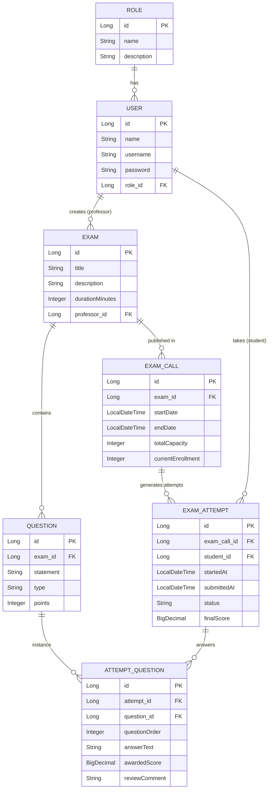
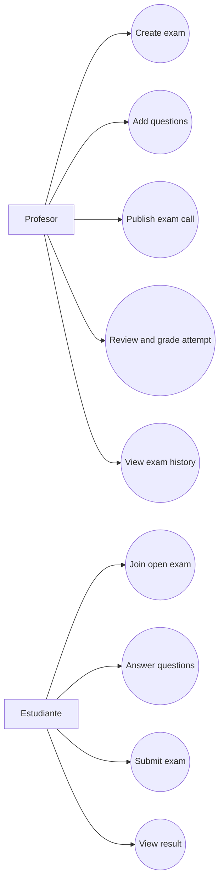

# Domain Model and Diagrams

## MVP Scope

- Autenticacion con roles: `PROFESSOR` y `STUDENT`
- Profesor crea examenes y preguntas
- Profesor publica convocatoria con ventana de tiempo
- Estudiante rinde solo en ventana abierta
- Intento unico por estudiante con orden aleatorio de preguntas
- Profesor revisa y califica sin modificar respuestas

## Entity Relationship Diagram

## Use Case Diagram

