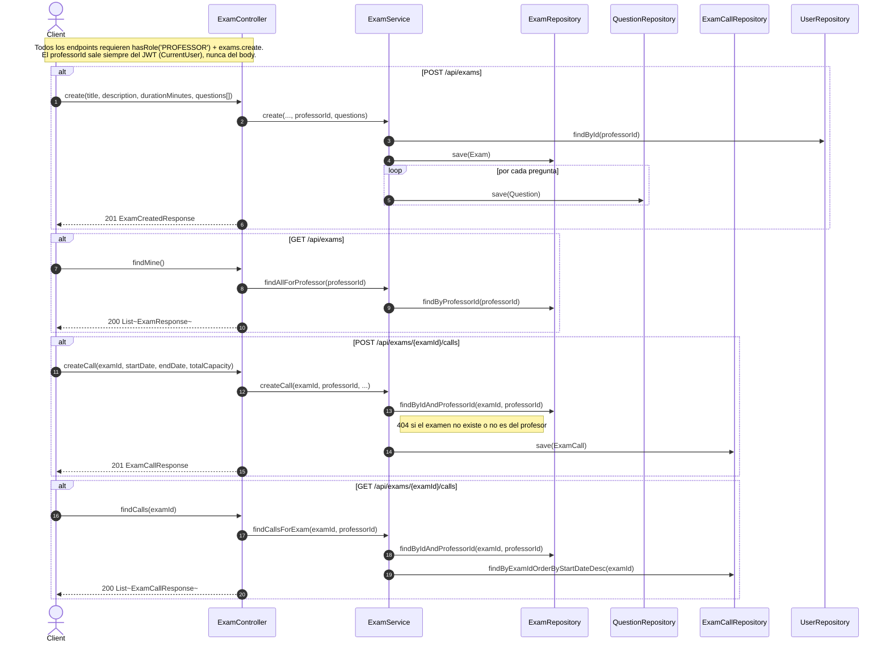
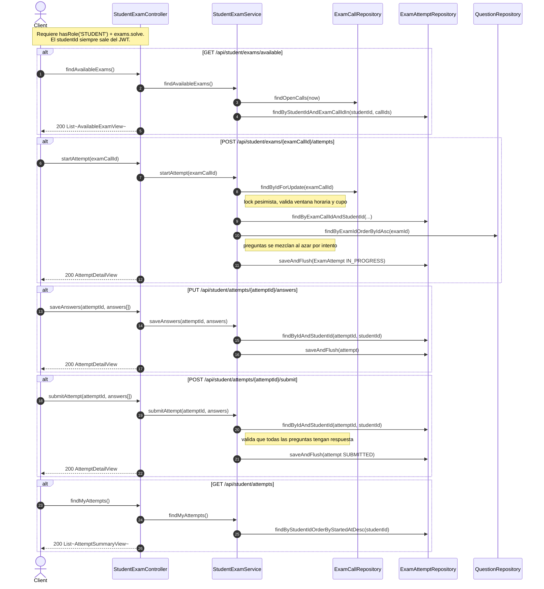
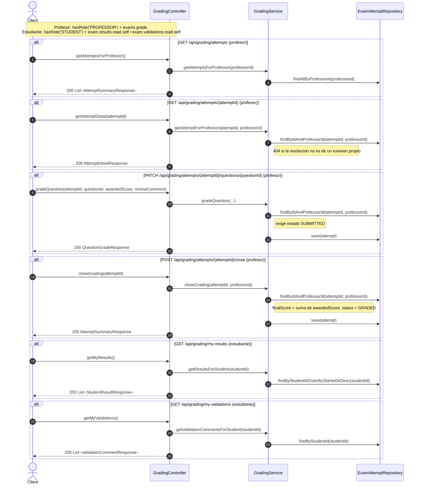
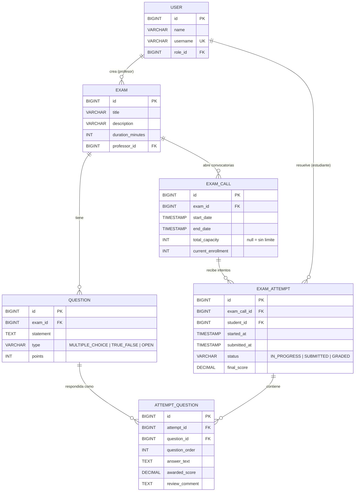

# Diagramas de flujo - dominio Exam

Mismo formato que `auth-users-diagrams.md`. Cubre los 3 casos de uso principales del dominio de examenes: crear examen (profesor), resolver examen (estudiante), corregir examen (profesor).

## Sequence diagram - Crear examen (Integrante 2 / Roque, backend cubierto por Valen)

## Sequence diagram - Resolver examen (Integrante 3 / Ema)

## Sequence diagram - Corregir examen (Integrante 4 / Valen)

## ERD - dominio Exam

## Notas

- Mismo criterio que `auth-users-diagrams.md`: nombres de entidades/campos en ingles, texto de flujo en espanol.
- El estado GRADED de `EXAM_ATTEMPT` es lo unico visible para el estudiante con nota final (`finalScore`); mientras esta en SUBMITTED, el estudiante ve el intento pero sin nota.
- `total_capacity` nulo en `EXAM_CALL` significa cupo ilimitado (ver `StudentExamService.hasCapacity`).
